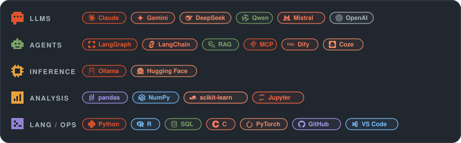

# Yunting D.

### BASc Arts and Sciences Graduate @ UCL,major in DSML

`LLM Reasoning` · `Multi-Agent Systems` · `Multimodal LLMs`

---

## Research interests

My research interests lie in **LLM reasoning**, **multi-agent systems**, and
**multimodal LLMs**, with applications spanning
**computational linguistics**, **behavioural finance**, and **energy economics**.
 

## Toolkit

 

## Selected work

- **[Dissertation — LLM × ESG × Investor Emotions](https://github.com/hd0811-code/Dissertation-LLM-ESG-Investor-Emotions)**  
  Psychologically informed LLM for understanding investor emotions in relation with energy stocks — An interdisciplinary study.
  
- **[Kaggle - CNN × Emotion Recognition](https://github.com/hd0811-code/Facial-Emotion-Recognition-Kaggle-FER-2013)**  
  Facial emotion classification from grayscale images using a custom CNN trained from scratch on the FER2013 dataset.
  
- **[Quantitative Methods III](https://github.com/hd0811-code/Quantitative-Methods-3)**  
  Moderation analysis at the intersection of energy and education.

  More coming up......

